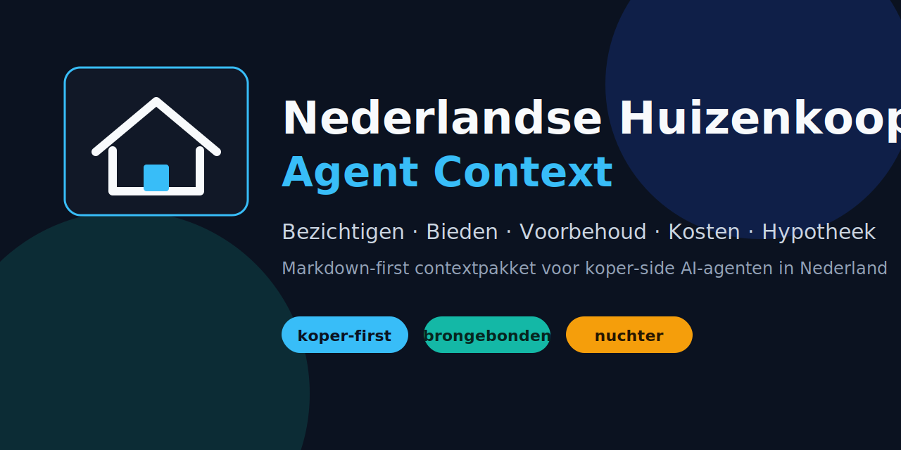

# Nederlandse Huizenkoop Agent Context



Open contextpakket voor AI-agenten die Nederlandse huizenkopers helpen met **bezichtigen, bieden, ontbindende voorwaarden, financiering, verkoop van de eigen woning, kosten koper en onderhandelen met makelaars**.

Dit project is Markdown-first: bedoeld om direct te lezen op GitHub én te kopiëren naar Claude, ChatGPT, Codex, Hermes of een andere agent.

> Doel: een AI-agent nuchter koper-first laten redeneren in de Nederlandse woningmarkt — niet als makelaar-brochure, niet als juridisch adviseur, maar als scherpe check op risico, prijs, voorwaarden en proces.

## Voor wie

- Nederlandse huizenkopers die een AI-agent willen voeden met betrouwbare context.
- Agentbouwers die een domeinpakket zoeken voor de Nederlandse huizenkoop.
- Kopers die bieddruk, makelaarstaal en voorwaarden willen ontleden vóór ze tekenen.

## Wat zit erin

| Onderdeel | Waarvoor |
|---|---|
| `docs/` | Leesbare gids over het volledige aankoopproces |
| `prompts/` | Copy-pastebare agentprompts voor koperbegeleiding |
| `examples/` | Synthetische cases, biedanalyse, kostenmodel en JSON-inputs voor calculators |
| `data/` | Rente-scenario aannames en andere expliciete rekentabel-inputs |
| `scripts/mortgage_budget.py` | Lokale hypotheek- en aankoopbudgetcalculator |
| `scripts/check.py` | Lokale validatie: bronsecties, privacywoorden, JSON, unit tests, structuur |
| `assets/hero.svg` | Publieke repo-hero/social preview |

## Snel gebruiken

Kopieer bijvoorbeeld:

```text
Gebruik de context uit docs/ en prompts/koper-agent.md.
Help mij als koper-side huizenkoopagent in Nederland.
Let op: geen juridisch of financieel advies, wel brongebonden procescontrole.
```

Of start met één concrete taak:

- [Bezichtigen checken](prompts/bezichtiging-check.md)
- [Bod reviewen](prompts/bod-review.md)
- [Tegenbod grillen](prompts/tegenbod-grill.md)
- [Aankoopmakelaar bellen](prompts/aankoopmakelaar-callscript.md)
- [Koopakte checken](prompts/koopakte-check.md)

## Inhoudelijke route

1. [Overzicht huizen kopen in Nederland](docs/00-overzicht-huizen-kopen-in-nederland.md)
2. [Rollen en belangen](docs/01-rollen-en-belangen.md)
3. [Financiële voorbereiding en maximale hypotheek](docs/02-financiele-voorbereiding-maximale-hypotheek.md)
4. [Kosten koper en extra kosten](docs/03-kosten-koper-en-extra-kosten.md)
5. [Zoeken en selecteren](docs/04-zoeken-en-selecteren.md)
6. [Bezichtigen en onderzoeksplicht](docs/05-bezichtigen-en-onderzoeksplicht.md)
7. [Waarde-inschatting en marktcontext](docs/06-waarde-inschatting-en-marktcontext.md)
8. [Bieden en biedstrategie](docs/07-bieden-en-biedstrategie.md)
9. [Biedlogboek en transparant bieden](docs/08-biedlogboek-en-transparant-bieden.md)
10. [Ontbindende voorwaarden](docs/09-ontbindende-voorwaarden.md)
11. [Financieringsvoorbehoud](docs/10-financieringsvoorbehoud.md)
12. [Bouwkundige keuring](docs/11-bouwkundige-keuring.md)
13. [Verkoop eigen huis en overbrugging](docs/12-verkoop-eigen-huis-en-overbrugging.md)
14. [Koopovereenkomst en bedenktijd](docs/13-koopovereenkomst-en-bedenktijd.md)
15. [Taxatie, hypotheek, notaris en overdracht](docs/14-taxatie-hypotheek-notaris-overdracht.md)
16. [Onderhandelen met makelaars](docs/15-onderhandelen-met-makelaars.md)
17. [Aankoopmakelaar: wel of niet](docs/16-aankoopmakelaar-wel-of-niet.md)
18. [Risico's en rode vlaggen](docs/17-risicos-rode-vlaggen.md)
19. [Agent playbooks](docs/18-agent-playbooks.md)
20. [Bronnen en verificatie](docs/19-bronnen-en-verificatie.md)
21. [Aankoopbudget variabelen en outputmodel](docs/20-aankoopbudget-variabelen-outputmodel.md)
22. [Hypotheek- en aankoopbudgetcalculator](docs/21-hypotheek-en-aankoopbudget-calculator.md)

## Belangrijke waarschuwing

Dit is **geen juridisch, financieel, bouwkundig of fiscaal advies**. Gebruik het als contextpakket en beslischeck. Laat koopakte, financiering, fiscaliteit en bouwkundige risico's controleren door bevoegde professionals zoals hypotheekadviseur, notaris, jurist, bouwkundige of Vereniging Eigen Huis.

## Publieke veiligheid

Gebruik alleen synthetische of geanonimiseerde cases. Zet nooit live biedstrategie, adressen, persoonlijke brieven, inkomensstukken, hypotheekdocumenten of makelaarscommunicatie in een publieke repo.

## Lokale validatie

```bash
make check
```

Dit controleert onder meer of elke doc een bronsectie heeft, of bekende privacygevoelige patronen niet per ongeluk zijn opgenomen, en of de lokale calculator-tests slagen.

Calculator-smoke:

```bash
python3 scripts/mortgage_budget.py --input examples/doorstromer-aankoopbudget-input.json
python3 scripts/mortgage_budget.py --input examples/doorstromer-scenarios-targetwoning-input.json
```


## Installatie / Installation

Geen package nodig. Clone of download de repo en lees/kopieer de Markdown-bestanden.

```bash
git clone https://github.com/viggomeesters/nederlandse-huizenkoop-agent-context.git
cd nederlandse-huizenkoop-agent-context
make check
```

## Gebruik / Usage

Gebruik de documenten als context voor een AI-agent. Start meestal met `prompts/koper-agent.md` en voeg daarna de relevante docs toe, bijvoorbeeld `docs/07-bieden-en-biedstrategie.md` of `docs/13-koopovereenkomst-en-bedenktijd.md`.

## Ontwikkeling / Development

Deze repo is bewust Markdown-first. Voeg nieuwe publieke kennis toe als leesbare `.md`, met bronsectie en synthetische voorbeelden. Run lokaal:

```bash
make check
```

## Licentie / License

Deze repo gebruikt de MIT-licentie. Je mag het contextpakket vrij gebruiken, aanpassen en herpubliceren binnen de voorwaarden van `LICENSE`. Let op: bronvermeldingen en publieke veiligheidswaarschuwingen zijn inhoudelijk belangrijk; verwijder die niet lichtvaardig bij hergebruik.

